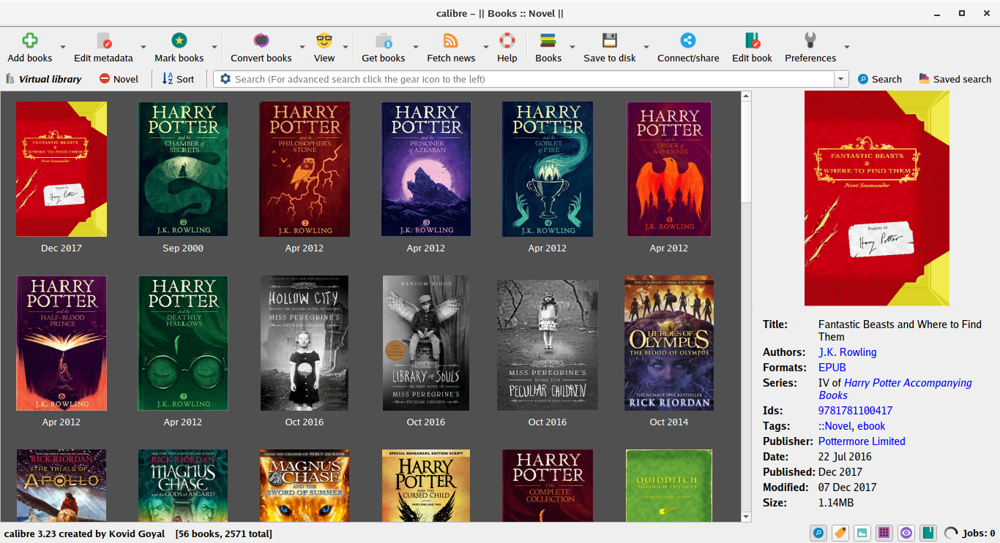
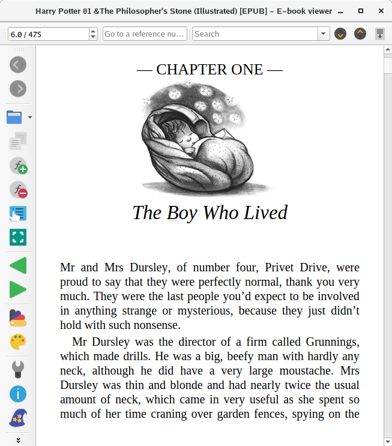
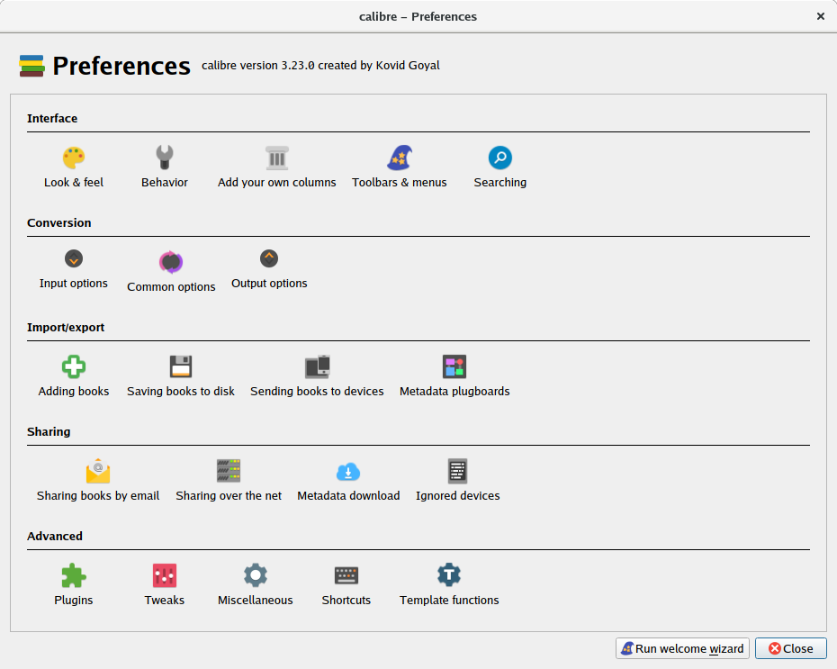
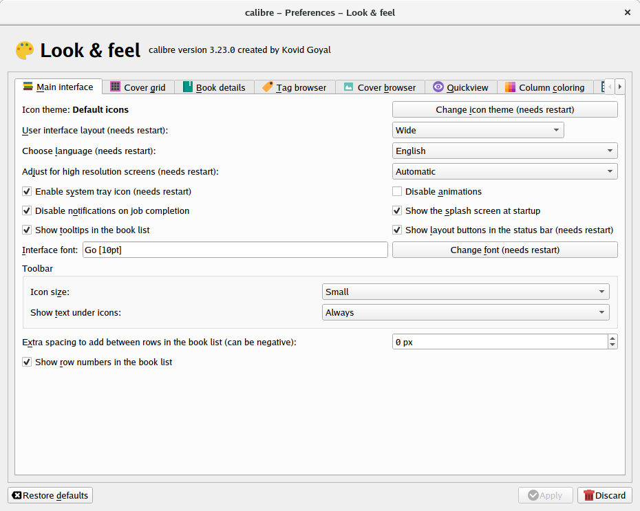
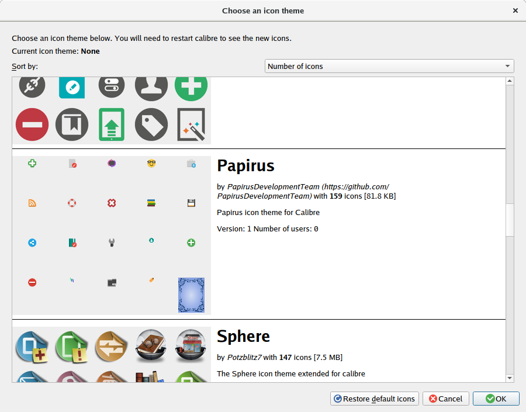

# Papirus Calibre Theme

<p align="center">
  
</p>
<p align="center">
  
</p>

## Installation

### Install from calibre preferences
Go to **Preferences** and choose **Look & Feel**
<p align="center">
  
</p>

click **Change icon theme**
<p align="center">
  
</p>

from the list choose **Papirus**
<p align="center">
  
</p>

###  Manual Install

1. Install dependencies:

    - git
    - make
    - librsvg2-bin

2. Run the following commands as normal user:

    ```
    git clone https://github.com/PapirusDevelopmentTeam/papirus-calibre-theme.git
    cd papirus-calibre-theme
    make build
    make install
    ```

3. Start Calibre and enjoy.
